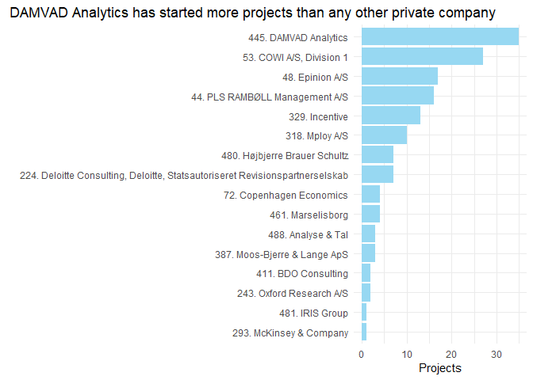
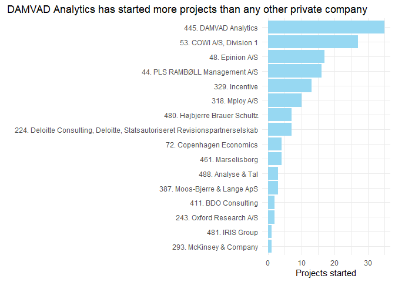

Who's using administrative register data from Statistics Denmark ?
==================================================================

Statistics Denmark publishes annual lists of all active projects using their administrative register data, along with information on who's responsible for the project, the project title, and a few other things. The information is available here: <https://www.dst.dk/da/TilSalg/Forskningsservice/Registerforskning/projekter>

The tables as somewhat messy html documents generated by SAS, but I just want a simple overview of who the most frequent users of the data are.

Getting and structuring the data
--------------------------------

Data is available for the years 2010-2017

``` r
years_w_data <- c(2010:2017)
```

Getting and structuring the data isn't all that interesting so I wrote a function to take care of this bit.

``` r
library(XML)
source("get_data.R")
data <- lapply(years_w_data, FUN=get_data)
data_all <- do.call("rbind", data)
```

The data contains all active projects each year. However, I am mostly interested in the number of distinct projects for each organization so for multi-year projects, I'm only interested in the first time the project appears in the list.

``` r
library(dplyr)
distinct_projects <- data_all %>% 
  group_by(Project_number) %>% 
  filter(Year==min(Year))
```

So which private company has had most projects the past three years?

``` r
most_projects <- distinct_projects %>% 
  filter(Year>=2015) %>%
  filter(Organization %in% private_companies) %>% 
  group_by(Organization) %>% 
  summarise(Projects = n()) %>% 
  arrange(desc(Projects))
most_projects
```

    ## # A tibble: 16 x 2
    ##    Organization                                                   Projects
    ##    <chr>                                                             <int>
    ##  1 445. DAMVAD Analytics                                                35
    ##  2 53. COWI A/S, Division 1                                             27
    ##  3 48. Epinion A/S                                                      17
    ##  4 44. PLS RAMBØLL Management A/S                                       16
    ##  5 329. Incentive                                                       13
    ##  6 318. Mploy A/S                                                       10
    ##  7 224. Deloitte Consulting, Deloitte, Statsautoriseret Revision~        7
    ##  8 480. Højbjerre Brauer Schultz                                         7
    ##  9 461. Marselisborg                                                     4
    ## 10 72. Copenhagen Economics                                              4
    ## 11 387. Moos-Bjerre & Lange ApS                                          3
    ## 12 488. Analyse & Tal                                                    3
    ## 13 243. Oxford Research A/S                                              2
    ## 14 411. BDO Consulting                                                   2
    ## 15 293. McKinsey & Company                                               1
    ## 16 481. IRIS Group                                                       1

``` r
library(ggplot2)
ggplot(data = most_projects,
       aes(x = reorder(Organization, Projects), y = Projects, fill="#97d8f2")) +
  geom_col() +
  scale_fill_manual(values ="#97d8f2") +
  labs(x="", title = "DAMVAD Analytics started more projects than any other private company in the past three years") +
  coord_flip() +
  theme_minimal() +
  theme(plot.title = element_text(hjust = 0.9)) +
  theme(legend.position = "none")
```



So DAMVAD Analytics is the private company that has used the data the most. But how has their usage varied over the years?

``` r
DAMVAD_Analytics <- distinct_projects %>% 
  filter(Organization == "445. DAMVAD Analytics") %>% 
  group_by(Year) %>% 
  summarise(Projects = n())
ggplot(data = DAMVAD_Analytics,
       aes(x = Year, y = Projects, fill="#97d8f2")) +
  geom_col() +
  scale_fill_manual(values ="#97d8f2") +
  labs(x="", title = "DAMVAD Analytics typically has 10-15 projects every year") +
  theme_minimal() +
  theme(legend.position = "none")
```


